# Intrusion Detection System (IDS)

Un système de détection d'intrusions réseau complet, développé avec Django, pour surveiller, analyser et répondre aux menaces de sécurité sur le réseau.

## Caractéristiques Principales

### Surveillance et Détection

- **Capture et analyse de paquets réseau en temps réel** avec Scapy
- **Détection multi-vecteurs d'attaques**:
  - Scans de ports (TCP/UDP/SYN)
  - Attaques DDoS (inondation SYN, UDP, ICMP)
  - Tentatives de brute force sur services critiques
  - Connexions suspectes vers des ports sensibles
  - Comportements anormaux du réseau
  - Trafic chiffré suspect
- **Détection basée sur diverses méthodologies**:
  - Signature-based (patterns connus d'attaques)
  - Anomaly-based (déviations des modèles de trafic normal)
  - Threshold-based (dépassements de seuils prédéfinis)
- **Moteur de règles avancé** avec évaluation en temps réel et différée
- **Classification de trafic par machine learning** pour identifier les attaques inconnues
- **Simulation d'attaques** pour tester la réactivité du système

### Gestion des Agents et Endpoints

- **Architecture distribuée avec agents de surveillance**:
  - Déploiement multi-plateforme (Linux, Windows, Docker)
  - Configuration à distance centralisée
  - Surveillance de l'état en temps réel (online/offline)
  - Collecte de logs sécurisée
- **Gestion du cycle de vie complet des agents**:
  - Génération et déploiement simplifié
  - Configuration personnalisée par agent
  - Désactivation temporaire ou permanente
  - Reconnexion automatique après déconnexion
- **API sécurisée** pour l'intégration avec les agents:
  - Authentification par token pour chaque agent
  - Endpoints pour enregistrement, heartbeat, et soumission de logs
  - Traitement asynchrone des données collectées

### Système de Notification et d'Alerte

- **Notifications en temps réel multi-canaux**:
  - Telegram (avec formatage riche et émojis contextuels)
  - Email (avec rapports détaillés)
  - Webhooks (pour l'intégration avec des systèmes tiers)
- **Alertes personnalisables**:
  - Prioritisation par niveau de sévérité (low, medium, high, critical)
  - Templates de messages configurables
  - Instructions d'action incluses pour les alertes critiques
- **Fonctionnalités avancées de notification**:
  - Test direct des configurations (Telegram, Email, Webhook)
  - Configuration immédiate après test réussi
  - Limitation intelligente pour éviter les surcharges
  - Journalisation complète des notifications envoyées
  - Possibilité de renouveler les notifications échouées
  - Interface dédiée aux diagnostics de notification

### Tableau de Bord et Analyse

- **Dashboard interactif** avec métriques en temps réel:
  - Vue d'ensemble de la sécurité réseau
  - Statistiques des événements détectés
  - États des agents de surveillance
  - Alertes récentes et leur statut
- **Visualisations avancées**:
  - Chronologie temporelle des événements
  - Distribution des types d'attaques
  - Répartition géographique des menaces
  - Graphiques de tendances par sévérité
- **Rapports personnalisables**:
  - Génération de rapports détaillés en PDF
  - Filtrage avancé par période, type et sévérité
  - Exportation de données au format CSV

### Administration et Configuration

- **Gestion complète des règles de détection**:
  - Création, édition et suppression via interface web
  - Activation/désactivation sans redémarrage
  - Tests de règles sur données historiques
- **Gestion des adresses IP bloquées**:
  - Blocage manuel ou automatique
  - Explication détaillée des raisons de blocage
  - Expiration configurable des blocages
- **Centre de commandes**:
  - Interface pour exécuter des outils de sécurité
  - Surveillance des tâches en cours
  - Historique des commandes exécutées
- **Configuration complète du système**:
  - Paramètres de notification
  - Seuils de détection
  - Options de stockage des logs

### Interface Utilisateur

- **Interface web responsive et intuitive**:
  - Navigation simplifiée
  - Filtres contextuels sur toutes les vues
  - Affichage concis des logs de notification
  - Modals détaillés pour informations complètes
- **Tableaux de données interactifs**:
  - Tri et filtrage avancés
  - Pagination optimisée
  - Actions contextuelles
- **Formulaires intelligents**:
  - Validation côté client et serveur
  - Aide contextuelle et suggestions
  - Prévisualisation des configurations

## Mode Endpoint

Le système IDS peut être exécuté en mode endpoint, ce qui lui permet de fonctionner sans dépendances externes comme RabbitMQ ou Redis.

### Prérequis pour le Mode Endpoint

- Python 3.8+
- Windows, Linux ou macOS

### Configuration du Mode Endpoint

Pour configurer l'IDS en mode endpoint, exécutez:

```
python manage.py setup_endpoint
```

Cette commande va:
- Installer les packages requis (django-celery-results, kombu, pika)
- Configurer les variables d'environnement pour le mode endpoint
- Créer une base de données SQLite
- Configurer les répertoires nécessaires pour le stockage local

### Exécution en Mode Endpoint

Pour lancer l'IDS en mode endpoint:

```
python manage.py run_endpoint
```

Cela démarre:
- Un serveur web Django sur le port 8000
- Des services de surveillance en arrière-plan pour le traitement des alertes
- Un stockage local pour les notifications et les journaux

### Caractéristiques du Mode Endpoint

- Fonctionne sans courtiers de messages externes (RabbitMQ/Redis)
- Utilise une base de données SQLite pour le stockage
- Exécute les tâches immédiatement (mode eager)
- Stocke les notifications localement lorsque hors ligne
- Traite les journaux localement

### Administration en Mode Endpoint

Accédez à l'interface d'administration à l'adresse http://localhost:8000/admin/

Identifiants par défaut:
- Nom d'utilisateur: admin
- Mot de passe: (défini lors de la configuration)

### Dépannage du Mode Endpoint

Si vous rencontrez des problèmes de base de données:
1. Supprimez le fichier db.sqlite3
2. Exécutez à nouveau `python manage.py setup_endpoint`

Pour tout autre problème, consultez les journaux dans le répertoire `logs`.

### Configuration Avancée du Mode Endpoint

Modifiez le fichier .env pour personnaliser les paramètres du mode endpoint:

```
USE_SQLITE=true
USE_REDIS=false
USE_RABBITMQ=false
ENDPOINT_MODE=true
USE_DB_AS_BROKER=true
CELERY_TASK_ALWAYS_EAGER=true
CELERY_FALLBACK_TO_DISK=true
USE_LOCAL_FALLBACK=true
```

## Technologies Utilisées

- **Backend** : Python 3.9+, Django 4.x
- **Analyse réseau** : Scapy
- **Base de données** : PostgreSQL/SQLite (configurable)
- **Conteneurisation** : Docker, Docker Compose
- **Frontend** : Bootstrap 5, Chart.js, Bootstrap Icons
- **Traitement asynchrone** : asyncio, Celery (optionnel)
- **Mise en cache** : Redis (optionnel)
- **Machine Learning** : scikit-learn, pandas

## Installation

### Prérequis

- Docker et Docker Compose (recommandé) ou:
- Python 3.9+
- Npcap (Windows) ou libpcap (Linux/macOS) pour la capture de paquets
- PostgreSQL (optionnel, SQLite par défaut)

### Configuration Rapide avec Docker

1. Clonez le dépôt :
   ```
   git clone https://github.com/votre-username/ids-project.git
   cd ids-project
   ```

2. Créez un fichier `.env` à la racine du projet avec les variables suivantes :
   ```
   # Base de données (PostgreSQL ou SQLite)
   USE_SQLITE=true
   # Si PostgreSQL est utilisé
   DATABASE_URL=postgres://ids_user:secure_password@db:5432/ids_db
   POSTGRES_USER=ids_user
   POSTGRES_PASSWORD=secure_password
   POSTGRES_DB=ids_db
   
   # Notifications
   TELEGRAM_TOKEN=your_telegram_bot_token
   TELEGRAM_CHAT_ID=your_telegram_chat_id
   
   # Django
   SECRET_KEY=your_django_secret_key
   DJANGO_SUPERUSER_USERNAME=admin
   DJANGO_SUPERUSER_EMAIL=admin@example.com
   DJANGO_SUPERUSER_PASSWORD=admin
   
   # Options avancées
   USE_REDIS=false
   CELERY_FALLBACK_TO_DISK=true
   ```
   (Voir le fichier README-env.md)

3. Lancez l'application avec Docker Compose :
   ```
   docker-compose up -d
   ```

4. Accédez à l'application à l'adresse http://localhost:8000

### Installation Manuelle

1. Clonez le dépôt et créez un environnement virtuel:
   ```
   git clone https://github.com/khalil-debug/ids-monitor.git
   cd ids-monitor
   python -m venv venv
   source venv/bin/activate  # Sur Windows: venv\Scripts\activate
   ```

2. Installez les dépendances:
   ```
   pip install -r requirements.txt
   ```

3. Configurez les variables d'environnement en créant un fichier `.env` (Voir le fichier README-env.md)

4. Initialisez la base de données:
   ```
   python manage.py makemigrations
   python manage.py migrate
   python manage.py createsuperuser
   ```

5. Lancez le serveur:
   ```
   python manage.py runserver
   ```

## Fonctionnalités Détaillées

### Système de Notification

Le système de notification offre une flexibilité et une fiabilité exceptionnelles:

- **Canaux multiples**:
  - **Telegram**: Notifications instantanées avec formatage enrichi
  - **Email**: Rapports détaillés avec indicateurs visuels de sévérité
  - **Webhook**: Intégration avec des systèmes tiers comme Slack, Discord ou des SIEM

- **Gestion des alertes**:
  - Priorisation automatique selon la sévérité de la menace
  - Regroupement intelligent d'alertes similaires pour éviter le spam
  - Limitation de débit configurable par heure/jour
  - File d'attente des notifications avec traitement asynchrone

- **Templates personnalisables**:
  - Format des messages adaptable par canal et type d'alerte
  - Variables dynamiques pour inclure des informations contextuelles
  - Émojis et formatage enrichi pour Telegram
  - Indicateurs d'actions recommandées pour les alertes critiques

- **Diagnostic et monitoring**:
  - Interface dédiée pour tester les configurations
  - Journalisation complète des notifications (réussies/échouées)
  - Possibilité de réessayer les envois échoués
  - Statistiques sur les alertes envoyées/échouées

### Détection et Analyse

Le système utilise plusieurs approches complémentaires pour maximiser la détection:

- **Analyse de paquets en temps réel**:
  - Inspection profonde de paquets pour identifier des signatures d'attaques
  - Détection de comportements anormaux (taux de connexion, taille des paquets)
  - Analyse des entêtes TCP/IP pour identifier des manipulations suspectes
  - Identification des menaces celon les règles configurés

- **Moteur de règles extensible**:
  - Règles basées sur des signatures (patterns spécifiques)
  - Règles basées sur des anomalies (déviations des comportements normaux)
  - Règles basées sur des seuils (dépassements de valeurs limites)
  - Import/export de règles au format standard

- **Analyse comportementale réseau**:
  - Établissement de lignes de base pour le trafic normal
  - Détection de déviations par rapport aux modèles historiques
  - Corrélation d'événements pour identifier des attaques multi-étapes

- **Classification par machine learning**:
  - Modèles pré-entraînés pour la détection d'attaques connues
  - Capacité d'apprentissage à partir des faux positifs/négatifs
  - Classification en temps réel du trafic suspect

### Gestion des Agents

L'architecture distribuée permet une couverture étendue de surveillance:

- **Cycle de vie des agents**:
  - Création simplifiée avec génération automatique de tokens
  - Déploiement sur divers endpoints (serveurs, postes de travail, conteneurs)
  - Surveillance de l'état et des performances en temps réel
  - Configuration à distance et mise à jour centralisée

- **Collecte de logs**:
  - Support de multiples sources (syslog, auth.log, journald, logs d'applications)
  - Filtrage configurable pour minimiser le bruit
  - Traitement et enrichissement des données avant stockage
  - Analyse en temps réel des logs critiques

- **Communications sécurisées**:
  - Authentification mutuelle entre agents et serveur central
  - Chiffrement TLS pour toutes les communications
  - Rotation des clés et tokens périodique
  - Contrôle granulaire des autorisations par agent

### Simulation et Tests

Pour valider l'efficacité du système:

- **Outils de simulation intégrés**:
  - Génération d'événements de sécurité réalistes
  - Simulation d'attaques spécifiques (scans, DDoS, brute force)
  - Tests de charge pour évaluer les performances sous stress
  - Vérification de la réactivité des alertes

- **Environnement de test**:
  - Configuration isolée pour tester de nouvelles règles
  - Rejouer des captures de trafic historiques
  - Évaluation des faux positifs/négatifs

### Lancement de la capture des packets

- **Pour démarrer la capture des paquets locale, utilisez la commande**:
  ````
  python manage.py run_analyzer
  ````
  ou utiliser l'interface sous le menu "Commands".


- **Pour configurer les règles initiales du système, utilisez la commande suivante**:
  ````
  python manage.py setup_initial_rules
  ````
  Cela permettra d'initialiser les règles de base pour la détection d'attaques et d'événements de sécurité.

  (Si vous utilisez Docker, exécutez cette commande à l'intérieur de l'image ids-poc-web)

## Captures d'Écran

### Interface Principale

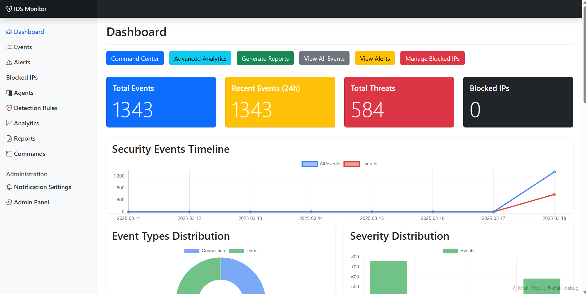

*Vue d'ensemble montrant les métriques clés de sécurité, l'état du système et les alertes récentes*

### Gestion des Événements

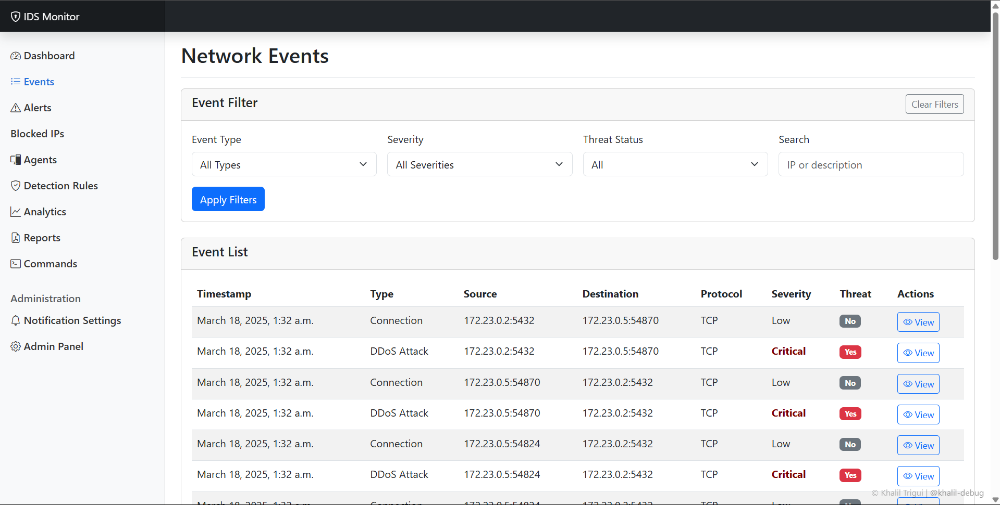
*Liste filtrable des événements réseau avec détails contextuels et indicateurs de sévérité*

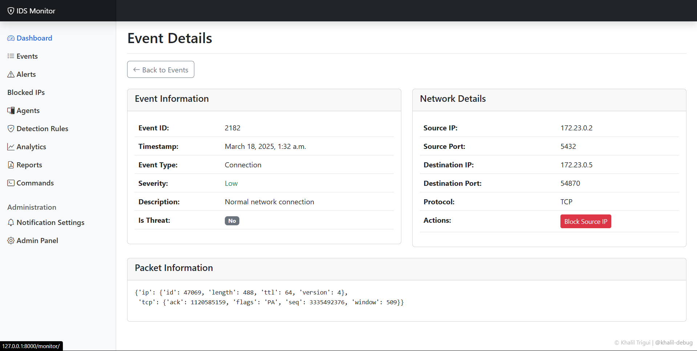
*Vue détaillée d'un événement de sécurité avec données de paquets et recommandations*

### Alertes et Notifications

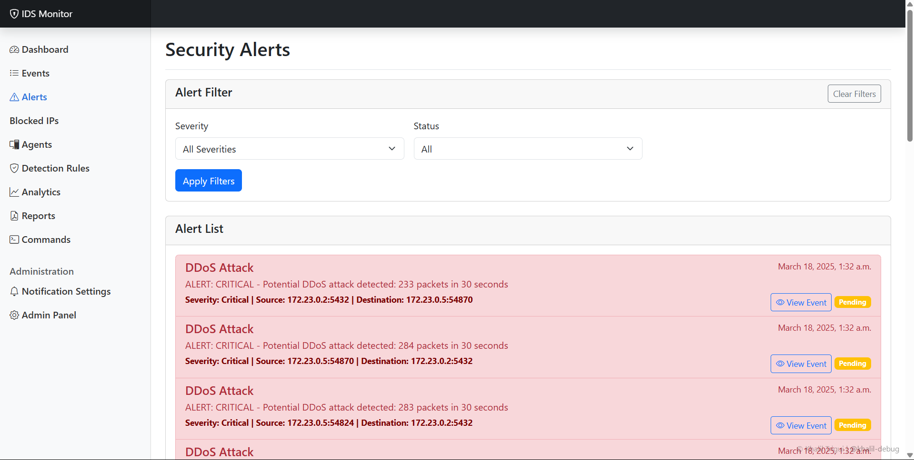
*Centre d'alertes avec priorisation, statut de notification et actions disponibles*

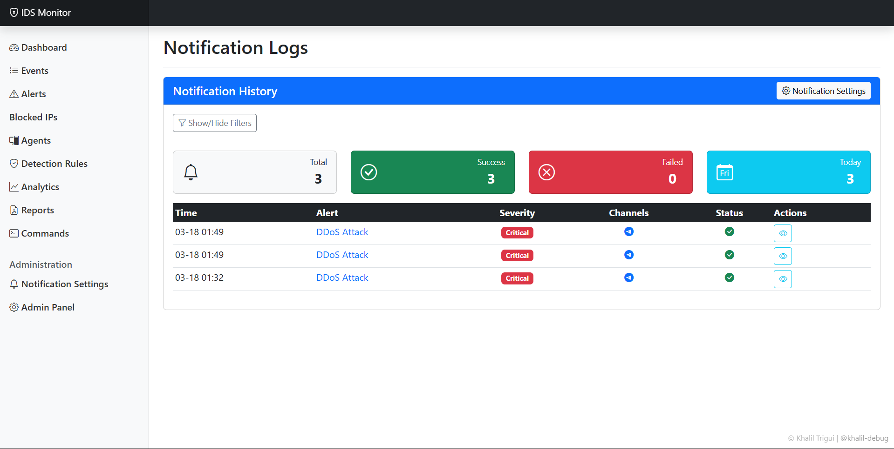
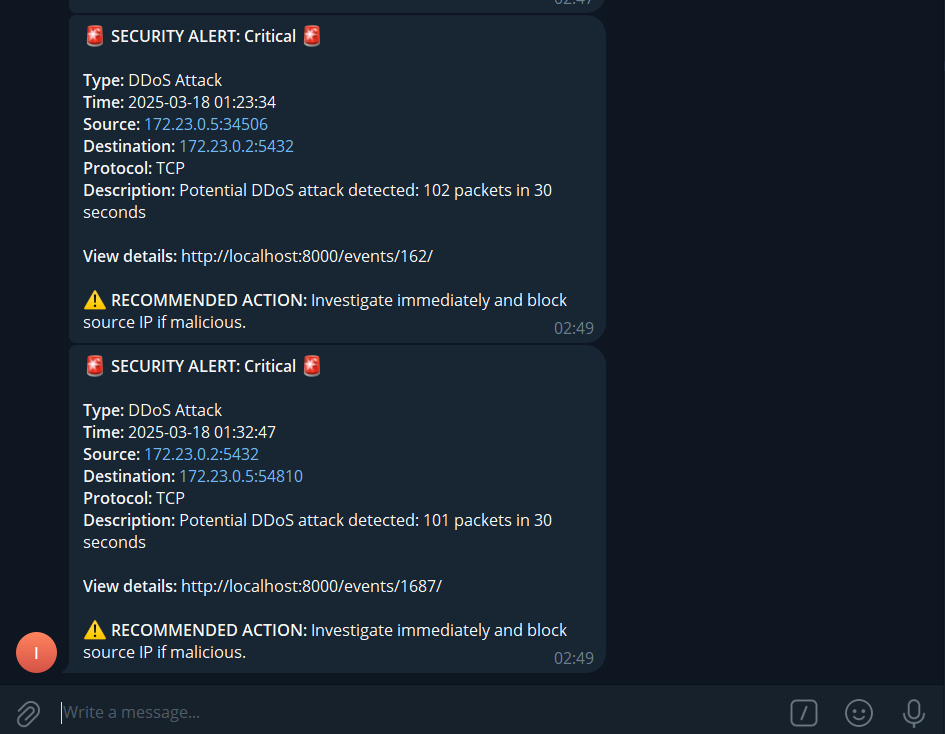
*Historique des notifications envoyées avec statut de livraison et options de diagnostic*

### Administration

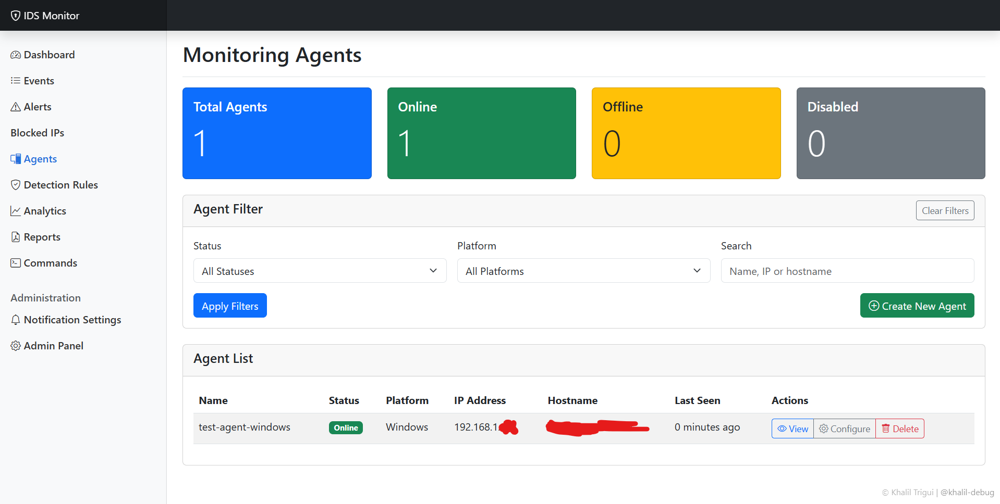
*Interface de gestion des agents de surveillance avec état et statistiques*

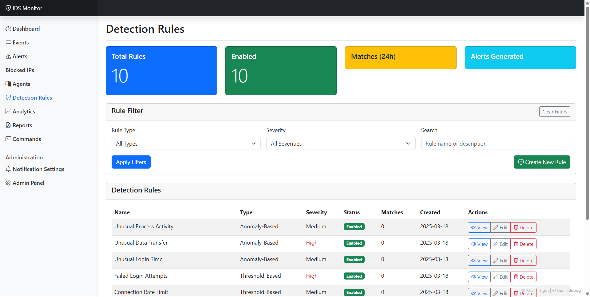
*Configuration des règles de détection avec éditeur avancé et tests*

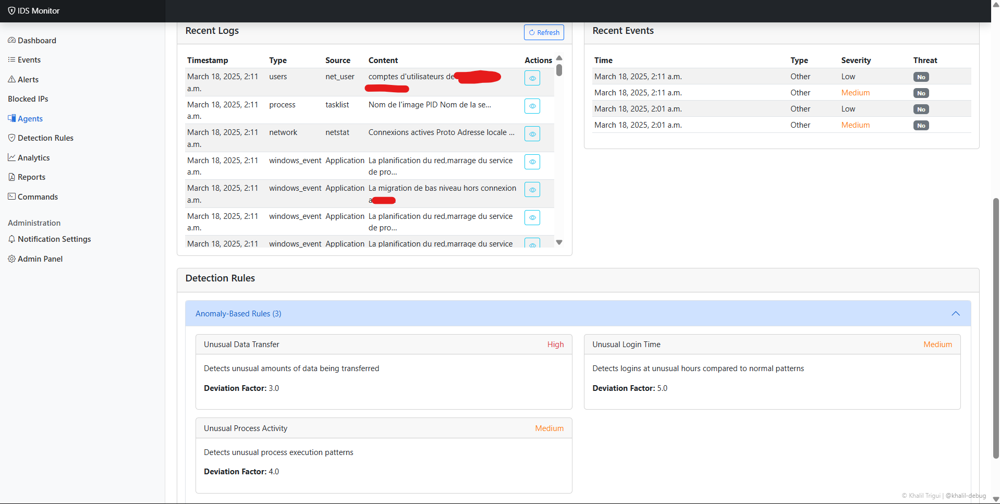
*Détails d'un agent, montrant son état actuel, ses paramètres de configuration, et ses evenements récents*

### Analyse et Rapports

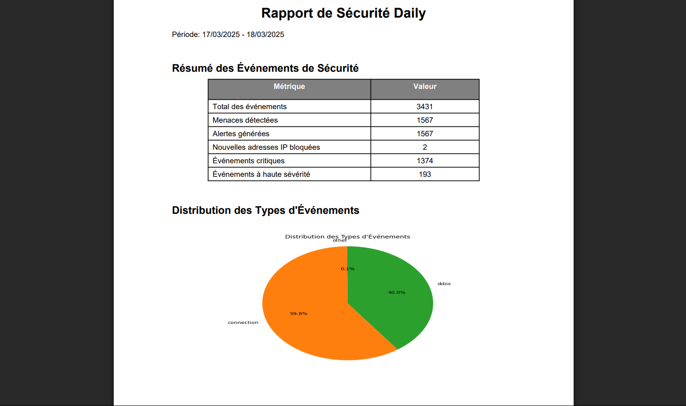
...
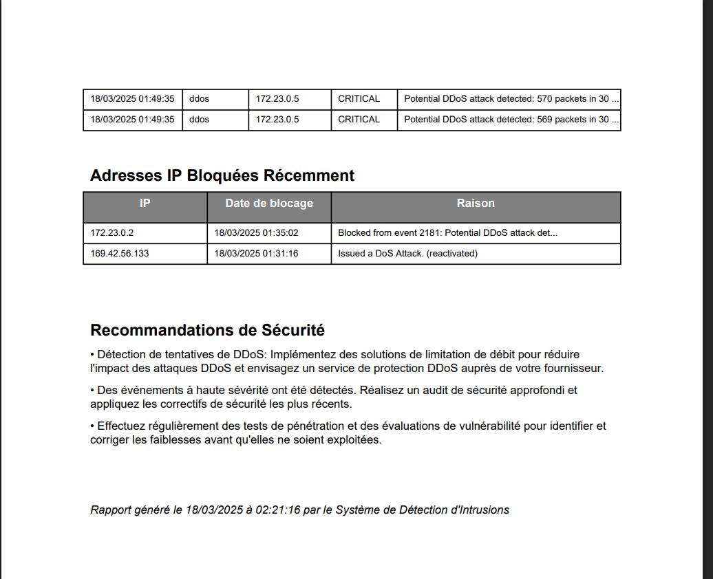
*Visualisations avancées pour l'analyse des tendances et patterns de sécurité*

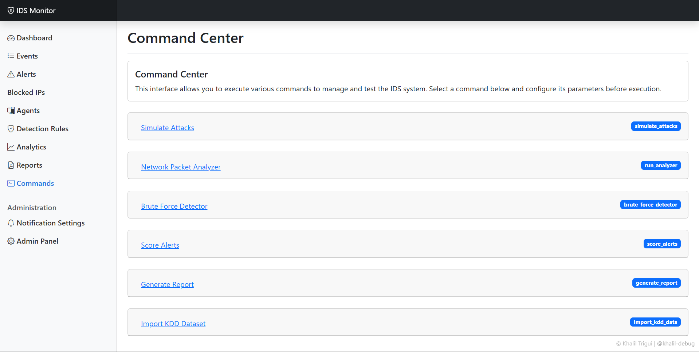
*Centre de commandes pour l'exécution et le contrôle des outils de sécurité*

Et plus...

## Architecture Technique

Le système est conçu avec une architecture modulaire pour faciliter l'extensibilité et la maintenance:

- **Core Engine**: Traitement et corrélation d'événements, application des règles
- **Data Collection**: Capture de paquets, collecte de logs, API agents
- **Analysis Engine**: Détection d'anomalies, application de ML, scoring de menaces
- **Notification System**: Gestion des alertes et distribution multi-canaux
- **User Interface**: Dashboard, visualisations, interfaces d'administration
- **Storage Layer**: Persistent storage for events, logs, configuration

### Diagramme d'Architecture

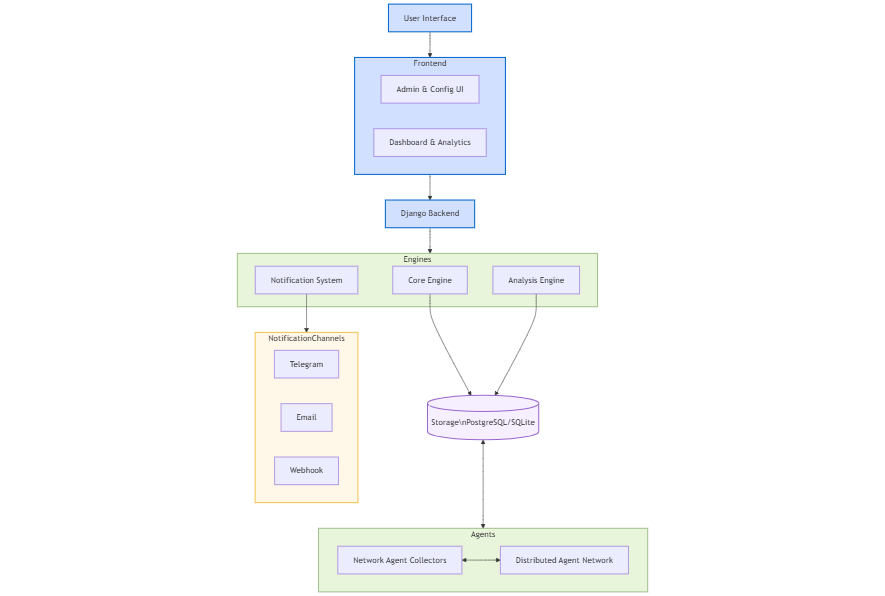

## Licence

Ce projet est sous licence MIT. Voir le fichier LICENSE pour plus de détails.

## Auteur

Trigui Khalil - [khaliltrigu@gmail.com](mailto:khaliltrigu@gmail.com)